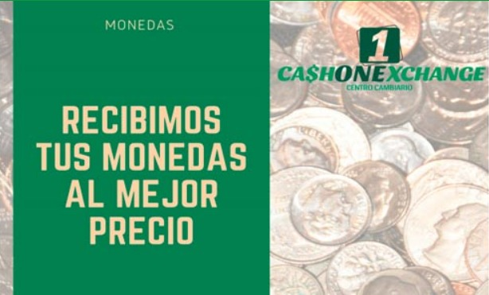
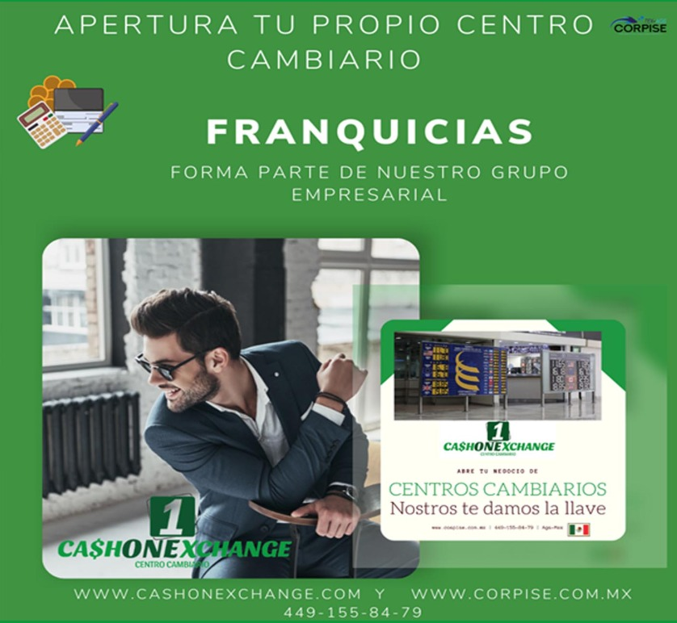
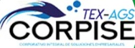

<!DOCTYPE html>
<html lang="es">
<head>
  <meta charset="UTF-8">
  <title>CASH ON EXCHANGE</title>
  
</head>
<body>

  <header>
    <h1>GRUPO EMPRESARIAL CORPISE CASH ONE</h1>
  </header>

  <nav>
    <a href="#nosotros">Nosotros</a>
    <a href="#definiciones">Definiciones</a>
    <a href="#servicios">Servicios</a>
    <a href="#franquicias">Franquicias</a>
    <a href="#formatos">Formatos</a>
    <a href="#sucursales">Sucursales</a>
    <a href="#contacto">Contacto</a>
  </nav>

  <main>
    <!-- ========================= NOSOTROS ========================= -->
    <section id="nosotros">
      <h2>Nosotros</h2>
      <h3><strong>¿Quiénes somos?</strong></h3>
      <h3>Somos un Grupo Empresarial integrado conforme a las disposiciones de carácter general a que se refiere el
      artículo 95 Bis de la Ley General de Organizaciones y Actividades Auxiliares del Crédito...</h3>

      <h3><strong>Misión</strong></h3>
      <h3>Otorgar servicios financieros de calidad a empresarios, turistas y viajeros...</h3>
      

      <h3><strong>Visión</strong></h3>
      <h3>Tener presencia nacional, creciendo bajo el modelo de grupos empresariales.</h3>
      

      <h3><strong>Valores</strong></h3>
      
      <h3><strong>Pasión:</strong> Hacer negocios con entrega total para que nuestros clientes nos prefieran.</h3>
      
      <h3><strong>Calidad:</strong> Buscar la excelencia.</h3>
      
      <h3><strong>Transparencia:</strong> Transparentar nuestras operaciones.</h3>
      
    </section>

    <!-- ====================== DEFINICIONES ======================= -->
    <section id="definiciones">
      <h2>Definiciones</h2>
      <h3><strong>Operaciones Permitidas</strong></h3>
      <ul>
        <li>Cambio de billetes, monedas, cheque de viajero...</li>
        <li>Cantidad diaria por persona: $10,000 USD</li>
        <li>Solo efectivo y cheques de viajero</li>
      </ul>
      <h3><strong>Operaciones Prohibidas</strong></h3>
      <ul>
        <li>Transferencias</li>
        <li>Liquidar por anticipado</li>
        <li>Aceptar billetes falsos...</li>
      </ul>
      <h3><strong>Identificaciones Válidas</strong></h3>
      <ul>
        <li>Identificaciones oficiales vigentes con fotografía</li>
        <li>Documentos expedidos por el Instituto Nacional de Migración...</li>
      </ul>
    </section>

    <!-- ====================== SERVICIOS ======================= -->
    <section id="servicios">
      <h2>Servicios</h2>
      <h3><strong>Compra y venta de efectivo</strong></h3>
      <ul>
        <li>Dólares</li>
        <li>Euros</li>
        <li>Dólar Canadiense</li>
      </ul>
      <h3><strong>Compra de metales amonedados</strong></h3>
      <ul>
        <li>Onza Libertad</li>
        <li>Centenario</li>
        <li>Onza de Oro...</li>
      </ul>
      
    </section>

    <!-- ====================== FRANQUICIAS ======================= -->
    <section id="franquicias">
      <h2>Franquicias</h2>
      <h3><strong>¿Por qué invertir en una franquicia?</strong></h3>
      <h3>Las estadísticas indican que el emprendedor independiente tiene el 80% de posibilidades de no llegar al segundo año...</h3>
      <h3><strong>Respaldo corporativo</strong></h3>
      <h3>Nuestro Grupo "CORPISE" cuenta con la experiencia y profesionalismo...</h3>
      <h3><strong>Modalidad renta</strong></h3>
      <h3>Única franquicia en el país de centros cambiarios que brinda modalidad de renta...</h3>
      
      <a href="#contacto" class="btn">Quiero más información</a>
    </section>

    <!-- ====================== FORMATOS ======================= -->
    <section id="formatos">
      <h2>Formatos</h2>
      <h3>Nuestros centros cambiarios pueden solicitar en cualquier momento cualquiera de los siguientes formatos:</h3>
      <ul>
        <li>Anexo 1: Sociedades, dependencias y entidades...</li>
        <li>Anexo 2: Identificaciones oficiales permitidas</li>
        <li>Anexo 3: Información de domicilio...</li>
        <li>Anexo 4, 5, 8, 9, 10, 13...</li>
      </ul>
      <a href="formatos.html" class="btn">Descargar Anexos</a>
    </section>

    <!-- ====================== SUCURSALES ======================= -->
    <section id="sucursales">
      <h2>Sucursales</h2>
      <h3><strong>Espacio</strong> - Av. Tecnológico #120...</h3>
      <h3><strong>Velaria</strong> - Av. Aguascalientes Sur S/N Local 7...</h3>
      <h3><strong>Calvillo</strong> - Independencia 108-A...</h3>
      <h3><strong>Morelos</strong> - José Maria Morelos y Pavón #215-A...</h3>
      <h3><strong>Hospitalidad</strong> - Calle Hospitalidad #119-B...</h3>
      <h3><strong>Huatulco</strong> - Benito Juarez No. 1-a Bis...</h3>
      <h3><strong>Los Cabos</strong> - Boulevard Marina Lote 6...</h3>
    </section>

    <!-- ====================== CONTACTO ======================= -->
    <section id="contacto">
      <h2>Contacto</h2>
      
      <h3>CORPISE CASH ONE S.A. DE C.V. CCO210209I76</h3>
      <h3>Priva Arquitectos 102, Colonia Centro, Aguascalientes, C.P. 20000</h3>
      <h3>Tel: 449-155-84-79 / 449-361-68-88</h3>
      <a class="btn" href="mailto:info@cashonexchange.com">Escríbenos</a>
    </section>
  </main>

  <footer style="text-align:center;padding:1rem;background:#fff;border-top:1px solid #e5e5e5;">
    
© 2025 CORPISE CASH ONE. Todos los derechos reservados.

  </footer>

</body>
</html>
